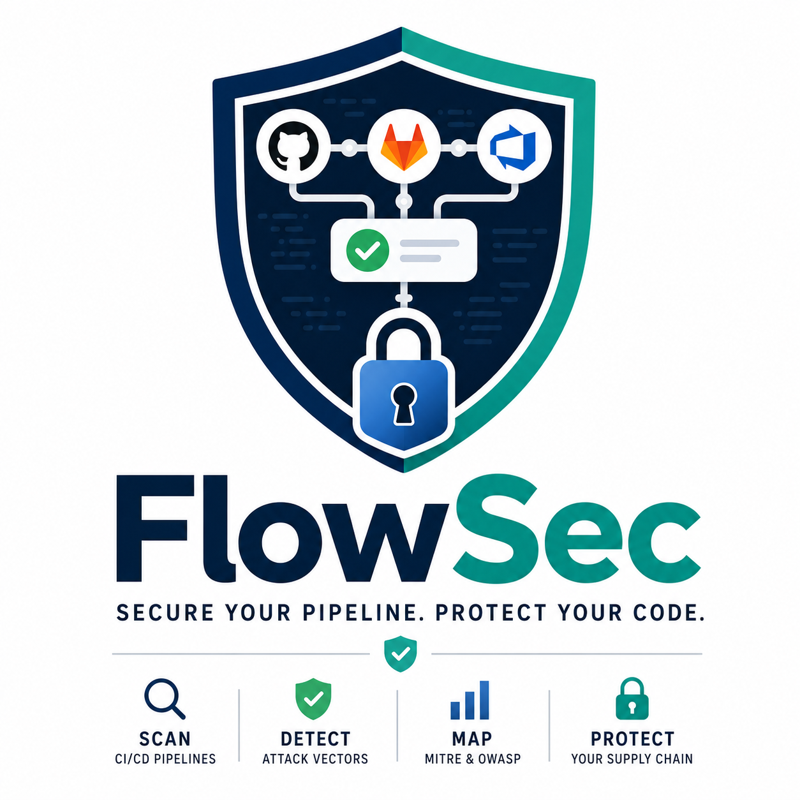

<p align="center">
  
</p>

<p align="center">
  <a href="https://codespaces.new/VanshBhardwaj1945/FlowSec"></a>
  <a href="https://badge.fury.io/py/flowsec"></a>
</p>

> A Python security tool that scans CI/CD pipeline configurations for attack vectors across GitHub Actions, GitLab CI, and Azure DevOps. Every finding maps to a MITRE ATT&CK technique and OWASP CICD Top 10 category.
>
> The pipeline is the attack surface. FlowSec treats it that way.

**[Full documentation](docs/FULL_README.md)**

---

## What it catches

| ID | Rule | Severity | MITRE | OWASP |
|---|---|---|---|---|
| FS001 | Hardcoded Secret — Plaintext Credential in Workflow | CRITICAL | T1552.001 | CICD-SEC-6 |
| FS002 | Unpinned Action — Supply Chain Attack Vector | CRITICAL | T1195.001 | CICD-SEC-3 |
| FS003 | Excessive Permissions — Overprivileged Workflow Token | HIGH | T1078 | CICD-SEC-5 |
| FS004 | Missing OIDC — Long-Lived Cloud Credential in Use | HIGH | T1552.004 | CICD-SEC-6 |
| FS005 | Pull Request Target — Secrets Exposed to Fork Code | CRITICAL | T1611 | CICD-SEC-4 |
| FS006 | Missing Timeout — Job Runs Up to 6 Hours Unchecked | LOW | T1499 | CICD-SEC-10 |
| FS007 | Self-Hosted Runner — Persistent Environment Risk | HIGH | T1053 | CICD-SEC-7 |
| FS008 | Missing Artifact Signing — No Tamper Protection | MEDIUM | T1553 | CICD-SEC-8 |
| FS009 | Unpinned Dependency — Package Installed Without Version Lock | HIGH | T1195.002 | CICD-SEC-3 |
| FS010 | Secret in Run Command — Plaintext Credential in Shell Step | CRITICAL | T1552.001 | CICD-SEC-6 |
| FS011 | GitHub Context Injection — Untrusted Event Data in Run Step | CRITICAL | T1059.004 | CICD-SEC-4 |
| FS012 | Missing Environment Protection — Deploy Job Has No Approval Gate | HIGH | T1078 | CICD-SEC-5 |
| FS013 | Workflow Dispatch Injection — Unvalidated Input in Shell Command | CRITICAL | T1059 | CICD-SEC-9 |
| FS014 | Mutable Container Image — Unpinned Image Tag in Pipeline | MEDIUM | T1195.001 | CICD-SEC-3 |
| FS015 | Persist Credentials — GitHub Token Remains in Git Config After Checkout | MEDIUM | T1552.001 | CICD-SEC-6 |
| FS016 | workflow_run Trigger — Privileged Execution from Untrusted Workflow | HIGH | T1059 | CICD-SEC-1 |
| FS017 | Security Scan Silenced — Failures Suppressed with continue-on-error | MEDIUM | T1562.001 | CICD-SEC-7 |
| FS018 | Secret as CLI Argument — Credential Exposed in Process List | HIGH | T1552 | CICD-SEC-6 |
| FS019 | Unverified Install Script — Remote Code Fetched and Executed Directly | HIGH | T1195.002 | CICD-SEC-3 |
| FS020 | Container Running as Root — Elevated Privilege in Pipeline | HIGH | T1611 | CICD-SEC-7 |
| FS021 | Secret in Docker Build Argument — Credential Stored in Image History | HIGH | T1552.001 | CICD-SEC-6 |
| FS022 | Broad Artifact Upload — Entire Workspace Exposed as Artifact | MEDIUM | T1560 | CICD-SEC-9 |
| FS023 | Insecure curl — SSL Verification Disabled in Pipeline | HIGH | T1071 | CICD-SEC-3 |
| FS024 | Privileged Docker Container — Full Host Access Granted in Pipeline | CRITICAL | T1611 | CICD-SEC-7 |
| FS025 | Environment Variables Printed to Logs — Secrets Exposed in Pipeline Output | MEDIUM | T1552.001 | CICD-SEC-6 |
| FS026 | Unguarded Deploy — Deployment Job Runs on Untrusted Branches | HIGH | T1078 | CICD-SEC-1 |

---

## Platforms supported

| Platform | File scan | Remote repo scan |
|---|---|---|
| GitHub Actions | `flowsec scan --github --file workflow.yml` | `flowsec scan --github --repo owner/repo` |
| GitLab CI | `flowsec scan --gitlab --file .gitlab-ci.yml` | `flowsec scan --gitlab --repo namespace/project` |
| Azure DevOps | `flowsec scan --azure --file azure-pipelines.yml` | `flowsec scan --azure --repo org/project` |

---

## Real findings on a real repo

Scanned `VanshBhardwaj1945/cloud-resume-challenge-azure` — 13 findings across 2 workflow files:

```
[CRITICAL] FS002 - Unpinned Action — Supply Chain Attack Vector
  File: .github/workflows/backend.main.yaml
  Action 'actions/checkout@v4' is not pinned to a commit hash

[HIGH]     FS003 - Excessive Permissions — Overprivileged Workflow Token
  File: .github/workflows/backend.main.yaml
  Pipeline permissions set to 'None' — GitHub defaults apply

[HIGH]     FS004 - Missing OIDC — Long-Lived Cloud Credential in Use
  File: .github/workflows/backend.main.yaml
  Cloud provider action present but no id-token: write permission

[LOW]      FS006 - Missing Timeout — Job Runs Up to 6 Hours Unchecked
  File: .github/workflows/backend.main.yaml
  Job 'build-and-deploy' has no timeout — GitHub default is 6 hours
```

---

## Stack

| Layer | Tools |
|---|---|
| Language | Python 3.11 |
| GitHub Connection | PyGithub |
| YAML Parsing | PyYAML with custom line-tracking loader |
| Terminal Output | rich |
| HTML Reports | Jinja2 — interactive filtering, expandable findings, PDF export |
| AI Narratives | Anthropic Claude API with local caching |
| Linting | ruff, mypy, bandit |
| Packaging | hatch, pyproject.toml |

---

## Quick Start

Click the Codespaces button above to run FlowSec in your browser with zero setup.

**Homebrew (macOS):**

```bash
brew install VanshBhardwaj1945/flowsec/flowsec
```

Or tap once then install:

```bash
brew tap VanshBhardwaj1945/flowsec
brew install flowsec
```

**PyPI:**

```bash
pip install flowsec
export GITHUB_TOKEN=your_token_here
flowsec scan --github --repo owner/repo
```

Or run from source:

```bash
git clone https://github.com/VanshBhardwaj1945/FlowSec.git
cd FlowSec
python3 -m venv .venv
source .venv/bin/activate
pip install -e ".[dev]"
cp .env.example .env
# Add your GITHUB_TOKEN to .env
```

---

## CLI

```bash
# Scan a GitHub Actions repo (remote)
flowsec scan --github --repo owner/repo

# Scan a local GitHub Actions file
flowsec scan --github --file .github/workflows/ci.yml

# Scan a GitLab CI file (local)
flowsec scan --gitlab --file .gitlab-ci.yml

# Scan a GitLab CI repo (remote — requires GITLAB_TOKEN)
flowsec scan --gitlab --repo namespace/project

# Scan an Azure DevOps file (local)
flowsec scan --azure --file azure-pipelines.yml

# Scan an Azure DevOps repo (remote — requires AZURE_DEVOPS_TOKEN)
flowsec scan --azure --repo org/project

# Generate an HTML report
flowsec scan --github --repo owner/repo --output report.html

# Generate AI attack narratives (requires ANTHROPIC_API_KEY)
flowsec scan --github --repo owner/repo --ai

# Ignore specific rules
flowsec scan --github --repo owner/repo --ignore FS006 --ignore FS011

# Fail pipeline if findings at or above threshold
flowsec scan --github --repo owner/repo --fail-on critical

# Everything at once
flowsec scan --github --repo owner/repo --ai --output report.html --fail-on high
```

---

## Rule Suppression

Suppress specific rules inline with `--ignore`:

```bash
flowsec scan --github --repo owner/repo --ignore FS006 --ignore FS011
```

Or create a `.flowsec.yml` in your repo root for persistent suppression:

```yaml
ignore:
  - rule_id: FS006
    reason: "We use external timeout management"
  - rule_id: FS011
    reason: "Branch protection managed at org level"
```

---

## Use as a Pipeline Gate

Add FlowSec to your own GitHub Actions workflow to automatically block PRs that introduce security misconfigurations:

```yaml
name: FlowSec Security Scan
on: [push, pull_request]
jobs:
  security:
    runs-on: ubuntu-latest
    steps:
      - uses: actions/checkout@v4
      - name: Install FlowSec
        run: pip install flowsec
      - name: Run FlowSec
        run: flowsec scan --github --file .github/workflows/ci.yml --fail-on critical
```

`--fail-on` supports `critical`, `high`, `medium`, and `low` thresholds.

---

## Status

| Component | Status |
|---|---|
| Rule engine — BaseRule, Finding, Severity | Complete |
| YAML parser with line number tracking | Complete |
| 26 security rules FS001-FS026 | Complete |
| MITRE ATT&CK + OWASP CICD Top 10 mapping | Complete |
| Platform-aware rule engine (GitHub/GitLab/Azure) | Complete |
| GitHub Actions scanner — remote repo and local file | Complete |
| GitLab CI scanner — remote repo and local file | Complete |
| Azure DevOps scanner — remote repo and local file | Complete |
| CLI — `--github/--gitlab/--azure` + `--file/--repo` | Complete |
| Rich terminal output with risk score (0-100) | Complete |
| HTML report with filtering, PDF export | Complete |
| AI attack narratives with local caching | Complete |
| Line number tracking | Complete |
| Pipeline gate `--fail-on` | Complete |
| Rule suppression `--ignore` and `.flowsec.yml` | Complete |
| GitHub Codespace config | Complete |
| PyPI publish with OIDC trusted publishing | Complete |
| Homebrew tap (`brew install VanshBhardwaj1945/flowsec/flowsec`) | Complete |
| CI security workflow (gitleaks, bandit, pip-audit, self-scan) | Complete |

---

## Roadmap

**Phase 2 — Expansion**
Jenkins support, AWS CodePipeline, 20+ rule library.

---

## Security

See [SECURITY.md](SECURITY.md) for the responsible disclosure policy.

---

## About this project

Built as a security engineering portfolio project. The goal was to build an actual security tool — not run existing ones — and document every decision along the way.

**[Read the full documentation](docs/FULL_README.md)**
